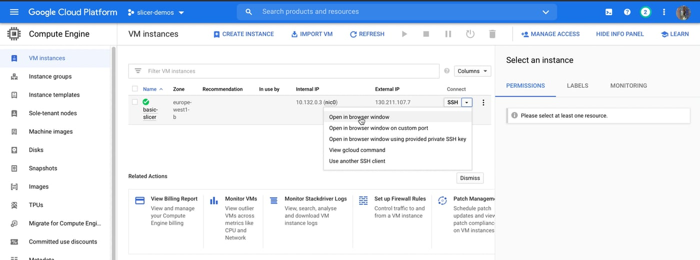
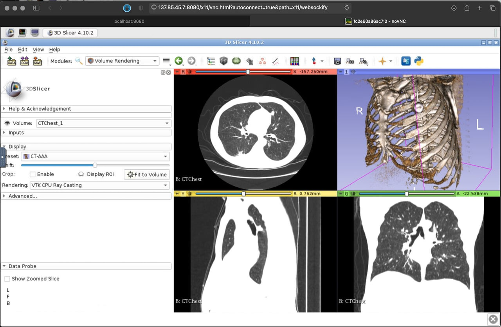
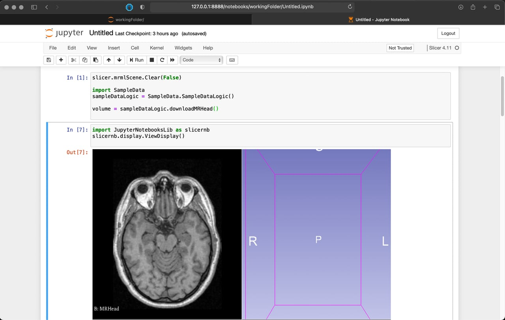

# Slicer Compose


Docker-compose implementations for running 3D Slicer in cloud environments.

## Project structure

```
.
├── Slicer          <- Slicer app container
├── SlicerJupyter   <- Slicer Jupyter server container
└── docs            <- Documentation and images
```

## Create a new VM

As an example GCE is used as the cloud provider.

Instructions of setting up a new machine are pretty basic. They go through installing basic packages, git and docker engine.

[See detailed walkthrough here](docs/gceconfig.md)



By the time you are done you should have a running machine and you are connected to the machine via ssh.

## Clone the SlicerCompose repository

```bash
git clone https://github.com/piiq/SlicerCompose.git
```

## Run slicer dockers

### Run Slicer "in the browser"

The compose file in this repository uses pre-built images from [SlicerDockers repository](https://github.com/pieper/SlicerDockers). If you need to customize the image check out the Dockerfiles and how they're built.

Navigate to the `Slicer` subfolder and launch docker-compose:

```bash
cd Slicer
docker-compose up -d
```

This will launch the container in deattached mode and make it auto-start on machine boot.



## Credentials for basic authorization

A file with `slicer:researcher` login and password is bundled with the repository by default.

You can create an `htpasswd` file with user access credentials on the remote machine to be used with the container.

For a user `slicer` with a password `researcher` the following command will create an `htpasswd` file:

```bash
echo "researcher" | htpasswd -c htpasswd slicer
```

---

### Run Jupyter Notebook server

Launch the container

```bash
cd SlicerJupyter
docker-compose up
```

After the container starts you will see a log message that contains text similar to this:

```
slicer-notebook_1  |     Or copy and paste one of these URLs:
slicer-notebook_1  |         http://57ff061693bc:8888/?token=0821a59da174e587a4f3ec7ecef303805f2149ad8b335e33
slicer-notebook_1  |      or http://127.0.0.1:8888/?token=0821a59da174e587a4f3ec7ecef303805f2149ad8b335e33
```

Copy the token and navigate to

```
http://your-machine-ip-address:8888
```

Enter the token and set the password.

After setting a password for the notebook server stop the container by pressing Ctrl+C and start the container in deatached mode:

```bash
docker-compose up -d
```


